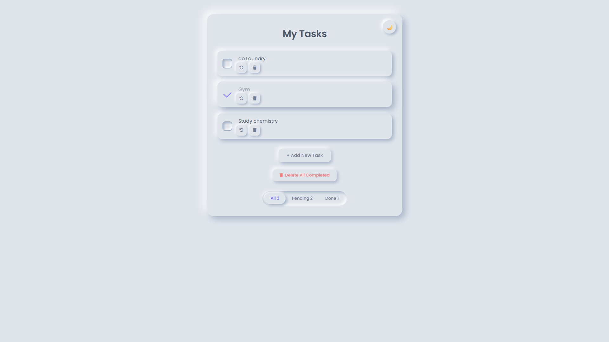

#  To-Do List App

A clean, minimal to-do list app built with vanilla HTML, CSS, and JavaScript — featuring a neumorphic UI, dark/light theme toggle, and persistent storage.

---

##  Features

- **Add & edit tasks** — click "+ Add New Task" or type directly in the task field
- **Complete tasks** — custom animated checkbox with a satisfying checkmark animation
- **Undo completion** — restore any completed task back to pending with the ↺ button
- **Delete tasks** — remove individual tasks or wipe all completed ones at once
- **Filter tasks** — switch between All / Pending / Done with a smooth sliding pill animation
- **Dark / Light theme** — toggle between themes, preference saved across sessions
- **Persistent storage** — all tasks and theme preference saved to `localStorage`, survives page refresh

---

##  Tech Stack

| Layer      | Technology |
|------------|------------|
| Markup     | HTML5      |
| Styling    | CSS3 (Neumorphism, CSS Variables, Flexbox) |
| Logic      | Vanilla JavaScript (ES6+) |
| Storage    | localStorage API |
| Icons      | Font Awesome 6 |
| Font       | Google Fonts — Poppins |

---

##  Project Structure

```
 todo-app/
├── index.html      # App structure & layout
├── style2.css       # Neumorphic styles + light/dark themes
└── index2.js       # All app logic (tasks, filters, theme, storage)
```

---

##  Getting Started

No installations, no dependencies, no build step.

1. Clone the repo
   ```bash
   git clone https://github.com/your-username/your-repo-name.git
   ```
2. Open `index.html` in your browser

That's it.

---

##  Theming

The entire color system is driven by CSS custom properties. Two themes are defined:

- **Light** — warm blue-grey neumorphic surface (`#e8ecf2`)
- **Dark** — deep violet-navy surface (`#22243a`)

Switching themes sets `data-theme="dark"` on the `<html>` element, which swaps all variables instantly. A global CSS transition makes every element animate smoothly.

---

##  How Data is Stored

Every user action (add, edit, check, delete) triggers `saveTask()`, which serializes the current task list as a JSON array into `localStorage`. On page load, `loadTasks()` reads it back and rebuilds the DOM — so your list is exactly where you left it.

```js
// Saved as:
[
  { "text": "Buy groceries", "completed": false },
  { "text": "Read a book",   "completed": true  }
]
```

---

##  Preview


##  Repo Description

> A neumorphic to-do list app with dark/light theme toggle, smooth filter animations, and localStorage persistence — built with pure HTML, CSS, and JavaScript.

---

##  License

MIT — free to use, modify, and distribute.
